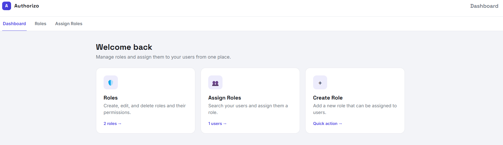
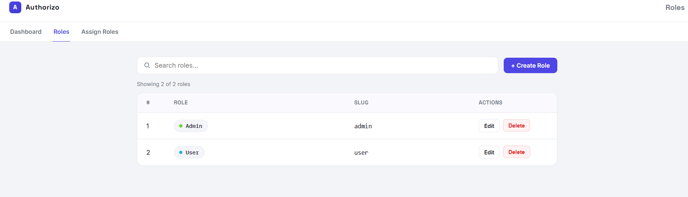
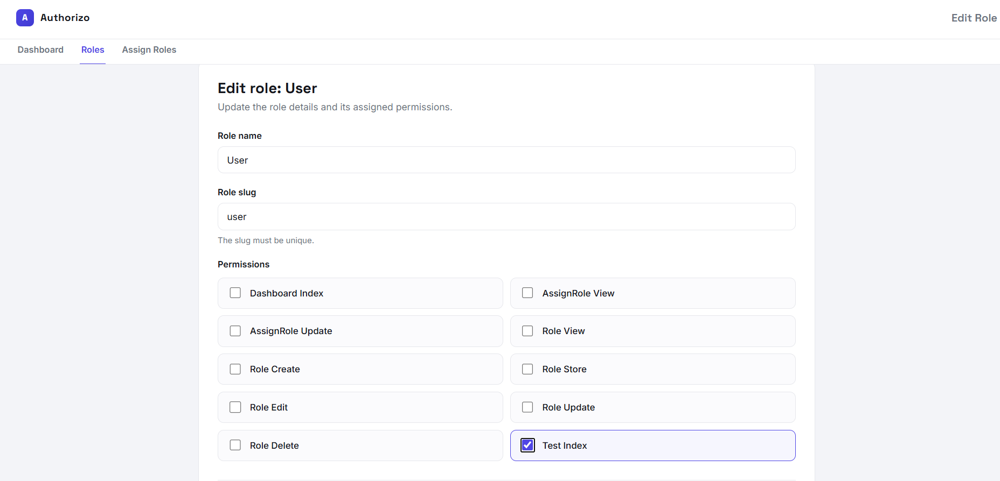
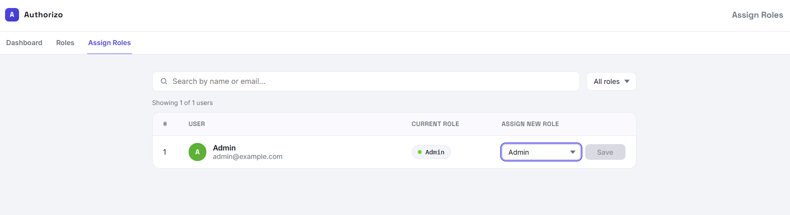

<div align="center">
    <h1>Authorizo</h1>
</div>

<p align="center">
    <a href="https://packagist.org/packages/saeedaz19/authorizo"></a>
    <a href="https://packagist.org/packages/saeedaz19/authorizo"></a>
    <a href="https://packagist.org/packages/saeedaz19/authorizo"></a>
    <a href="https://github.com/saeedaz19/authorizo/actions"></a>
    <a href="https://packagist.org/packages/saeedaz19/authorizo"></a>
</p>

Authorizo is a lightweight role and permission management package for Laravel. It provides database tables, a role relationship for your user model, an authorization middleware, an installer command, and a simple admin UI for managing roles and assigning them to users.

## Requirements

- PHP 8.3 or higher
- Laravel 12 or 13

## Installation

Install the package via Composer:

```bash
composer require saeedaz19/authorizo
```

Publish and run the migrations:

```bash
php artisan vendor:publish --tag="authorizo-migrations"
php artisan migrate
```

Add the `HasAuthorizo` trait to your user model:

```php
use Authorizo\Authorizo\Traits\HasAuthorizo;
use Illuminate\Foundation\Auth\User as Authenticatable;

class User extends Authenticatable
{
    use HasAuthorizo;
}
```

Run the installer command:

```bash
php artisan authorizo:install
```

The installer scans routes that use the `authorizo` middleware, creates permissions from their controller and action names, and creates the default `admin` and `user` roles.

## Screenshots

### Dashboard



### Roles & Permissions





### Assign Role



## Configuration

You may publish the configuration file:

```bash
php artisan vendor:publish --tag="authorizo-config"
```

## Admin UI

Authorizo registers its admin routes automatically under the `admin` prefix:

```text
/admin/authorizo
/admin/role
/admin/role/create
/admin/assign
```

The package also registers the `authorizo` middleware alias. Routes protected by this middleware are checked against the authenticated user's role permissions.

```php
use App\Http\Controllers\PostController;
use Illuminate\Support\Facades\Route;

Route::middleware(['web', 'auth', 'authorizo'])->group(function () {
    Route::get('/posts', [PostController::class, 'index']);
    Route::post('/posts', [PostController::class, 'store']);
});
```

For a controller action such as `PostController@index`, Authorizo looks for a permission with the slug:

```text
post.index
```

## Publishing Resources

Publish all package resources:

```bash
php artisan vendor:publish --tag="authorizo"
```

Or publish only what you need:

```bash
php artisan vendor:publish --tag="authorizo-config"
php artisan vendor:publish --tag="authorizo-migrations"
php artisan vendor:publish --tag="authorizo-views"
php artisan vendor:publish --tag="authorizo-lang"
```

## Testing

Run the package test suite:

```bash
composer test
```

You may also run the checks individually:

```bash
composer analyse
composer lint:check
composer test:types
composer test:unit
```

## Changelog

Please see [CHANGELOG](CHANGELOG.md) for more information on what has changed recently.

## Contributing

Thank you for considering contributing to Authorizo! Please review our [contributing guide](.github/CONTRIBUTING.md) to get started.

## Security Vulnerabilities

Please review [our security policy](.github/SECURITY.md) on how to report security vulnerabilities.

## Credits

- [saeedAZ19](https://github.com/saeedaz19)
- [All Contributors](../../contributors)

## License

Authorizo is open-sourced software licensed under the [MIT license](LICENSE.md).
